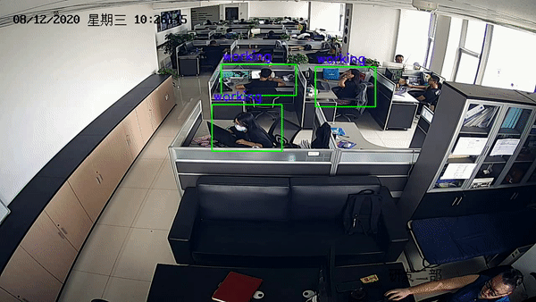

# Video recognition

[](https://github.com/bruce1408/Pytorch_learning)


This repository provides tutorial code for deep learning researchers to learn [video recognition](https://openaccess.thecvf.com/content_cvpr_2017/html/Zhu_Deep_Feature_Flow_CVPR_2017_paper.html)

Early research on video-based behavior recognition technology is mainly used in the field of intelligent surveillance. For example, the video surveillance and monitoring project implemented in the United States in 1997 is mainly used to realize a full range of intelligent surveillance systems in cities and battlefields that can track pedestrians and identify some simple behavior. In recent years, there are mainly three deep learning methods used for behavior recognition, namely, the behavior recognition method based on dual-stream convolutional neural network, the behavior recognition method based on 3D convolutional neural network, and the behavior recognition method based on recurrent neural network. The behavior recognition method based on the dual-stream convolutional neural network was first proposed by the VGG team. The main idea of the algorithm is to decompose the video frame into RGB images and optical flow images by preprocessing the video, and then input the RGB images into the spatial flow network to transfer the light The stream image is input to the time stream network, the two networks are jointly trained, and finally the final recognition result is obtained by fusion of the two methods of direct averaging.

# Table of Contents

- [Installation](#installation)
- [Models DataSet](#Models-DataSet)
- [Usage](#usage)
- [Results](#results)
- [Contributors](#Contributors)
- [Reference](#Reference)

# Installation

This project uses [slowfast](https://github.com/facebookresearch/SlowFast).

## Requirements

- CUDA >= 10.0
- pytorch >= 1.5.0
  $ pip install -r requirements.txt
- Python >= 3.6
- Numpy
- PyTorch 1.3
- [fvcore](https://github.com/facebookresearch/fvcore/): `pip install 'git+https://github.com/facebookresearch/fvcore'`
- [torchvision](https://github.com/pytorch/vision/) that matches the PyTorch installation.
  You can install them together at [pytorch.org](https://pytorch.org) to make sure of this.
- simplejson: `pip install simplejson`
- GCC >= 4.9
- PyAV: `conda install av -c conda-forge`
- ffmpeg (4.0 is prefereed, will be installed along with PyAV)
- PyYaml: (will be installed along with fvcore)
- tqdm: (will be installed along with fvcore)
- iopath: `pip install -U iopath` or `conda install -c iopath iopath`
- psutil: `pip install psutil`
- OpenCV: `pip install opencv-python`
- torchvision: `pip install torchvision` or `conda install torchvision -c pytorch`
- tensorboard: `pip install tensorboard`
- moviepy: (optional, for visualizing video on tensorboard) `conda install -c conda-forge moviepy` or `pip install moviepy`
- [Detectron2](https://github.com/facebookresearch/detectron2):

```
    pip install -U torch torchvision cython
    pip install -U 'git+https://github.com/facebookresearch/fvcore.git' 'git+https://github.com/cocodataset/cocoapi.git#subdirectory=PythonAPI'
    git clone https://github.com/facebookresearch/detectron2 detectron2_repo
    pip install -e detectron2_repo
    # You can find more details at https://github.com/facebookresearch/detectron2/blob/master/INSTALL.md
```

## PySlowFast

Clone the PySlowFast Video Understanding repository.

```
git clone https://github.com/facebookresearch/slowfast
```

Add this repository to $PYTHONPATH.

```
export PYTHONPATH=/path/to/SlowFast/slowfast:$PYTHONPATH
```

### Build PySlowFast

After having the above dependencies, run:

```
git clone https://github.com/facebookresearch/slowfast
cd SlowFast
python setup.py build develop
```

Now the installation is finished, run the pipeline with:

```
python tools/run_net.py --cfg configs/Kinetics/C2D_8x8_R50.yaml NUM_GPUS 1 TRAIN.BATCH_SIZE 8 SOLVER.BASE_LR 0.0125 DATA.PATH_TO_DATA_DIR path_to_your_data_folder
```

# Models DataSet

[download](https://pan.baidu.com/s/1jXDLcpSBOkon-HBxWRLY1w) pasd: vtur

```
1. save the faster_rcnn_R_50_FPN_1x file into configs/COCO-Detection/

2. cp -r weights video_recognition/config/

3. cp -r yolo4_weights.pth yolo4_voc_weights.pth  video_recognition/ai/model_data/

4. mp -r checkpoints/ video_recognition/

5. cp -r weights4, weights6 video_recognition/ai/core/data/

6. cp -r yolo4_voc_weights.pth yolo4_weights.pth video_recognition/model_data/

7. cp -r model_0017999.pth model_final_280758.pkl video_recognition/configs/weights

8. copy the train_data in your root directory

```

# Usage

> 1.  use a trained [yolo-v4](https://github.com/bruce1408/object_detection/tree/master/YOLO_v4) detection and [action recognition](https://github.com/bruce1408/SlowFast_tst) model.
> 2.  put your to be tested video files into testVideo/ directory, configure the parameters in _ai/tempConfig/config.json_
> 3.  modify the configuration file in _demo/Kinetics/SLOWFAST_8x8_R50_.yaml
> 4.  run the model
>     python main.py or refer to the [QUICK_START](https://github.com/facebookresearch/SlowFast/blob/master/GETTING_STARTED.md)

```
the model path is modified as follows :
CHECKPOINT_FILE_PATH_1: /xxx/checkpoints/checkpoint_epoch_00269.pyth
CHECKPOINT_FILE_PATH_2: /xxx/checkpoints/checkpoint_epoch_00210.pyth
CHECKPOINT_FILE_PATH_3: /xxx/checkpoints/checkpoint_epoch_00250.pyth

Here i used the model ensemble algorithm, three models to jointly predict the result to improve accuracy.
```

# Results

> Pic 1 is the result of the official data training, pic2, pic3, pic4 are the results of our moupdels.

<div align="center">
    
    
    
    

</div>

# Reference

- [slowfast](https://github.com/facebookresearch/SlowFast)

- [SlowFast Networks for Video Recognition](https://openaccess.thecvf.com/content_ICCV_2019/html/Feichtenhofer_SlowFast_Networks_for_Video_Recognition_ICCV_2019_paper.html)

# Contributors

This project exists thanks to all the people who contribute.
Everyone is welcome to submit code.
